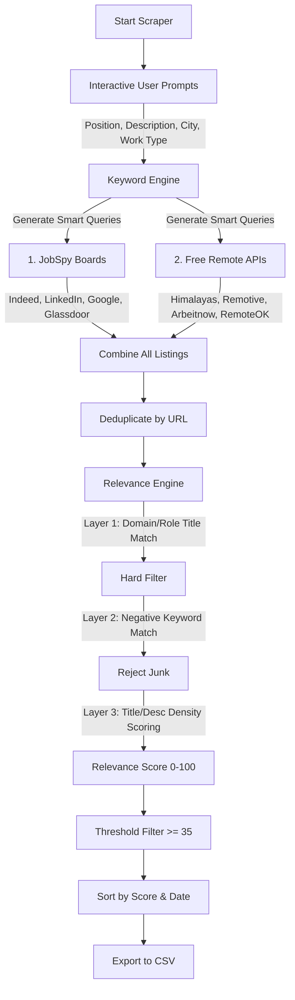

# 🤖 Smart Job Scraper v3.0 (Interactive Multi-API)

[](https://www.python.org/)
[](https://opensource.org/licenses/MIT)
[](https://github.com/cullenwatson/JobSpy)
[]()

A professional-grade, interactive, multi-source job scraping and aggregation pipeline. v3.0 introduces an interactive prompt to search for any tech role, generates smart search queries, and strictly filters out junk postings using a multi-layer relevance scoring engine.

---

## 📊 Pipeline Architecture

This scraper integrates standard browser scraping engines and modern public job board APIs to collect, score, and export the most relevant listings posted within the last 48 hours:



---

## ✨ Features

- **Interactive Prompts**: No need to hardcode configurations! The scraper asks for your target position, a brief description, city, and work type at runtime.
- **Dynamic Keyword Engine**: Automatically expands your input into 15+ smart search queries. Also generates "must-have" and "negative" keywords tailored to the role.
- **Multi-Source Aggregation**: Extracts listings concurrently from 8 premium job boards and APIs:
  - **JobSpy**: Indeed, LinkedIn, Google Jobs, Glassdoor
  - **Free Remote APIs**: Himalayas, Remotive, Arbeitnow, RemoteOK
- **Intelligent Relevance Scoring**: Rejects unrelated jobs (e.g., Marketing, Sales, Senior roles when looking for Internships) and scores remaining jobs out of 100 based on title and description keyword density.
- **Freshness Filter**: Strictly pulls jobs posted in the **last 48 hours**.
- **Automated Deduplication**: Automatically handles duplicate URLs across multiple job boards.
- **Dynamic Export**: Outputs the highest-quality results to a dynamically named, quotation-safe CSV file (e.g., `backend_developer_internship_2026-05-31.csv`).

---

## 🔧 Prerequisites

Before running the scraper, ensure you have the following installed:

1. **Python 3.10+**
   - Check if installed:
     ```bash
     python --version
     ```
   - If not installed, download from [python.org](https://www.python.org/).

2. **Required Libraries**
   - Install via pip:
     ```bash
     pip install pandas requests beautifulsoup4 tls-client markdownify pydantic numpy
     ```
   - *(Optional)* If you are using Poetry for dependency management, you can install everything in one command:
     ```bash
     poetry install
     ```

---

## 🚀 How to Run

1. **Clone the repository:**
   ```bash
   git clone https://github.com/M-Talha-Farooqi/Amazon_Automation.git
   cd Amazon_Automation
   ```
   *(Note: Adjust the repository URL to match your actual repository's URL)*

2. **Run the job scraper:**
   ```bash
   python search_jobs.py
   ```
3. **Follow the interactive prompts:**
   - **Position**: e.g. "AI/ML Internship", "Backend Developer"
   - **Description**: Provide key skills to boost relevance scoring (e.g. "python, django, machine learning")
   - **City**: e.g. "Lahore" (or leave blank for worldwide)
   - **Work Type**: Choose from Remote, Onsite, Hybrid, or Any

4. The scraper will fetch jobs, score them, reject irrelevant postings, and save the top results to a CSV file in the same directory!

---

## 👨‍💻 Author
**Marfowa**
- *Final Year BS Software Engineering Student*
- *University of Management and Technology, Lahore*

---

## 📄 License

This project is licensed under the MIT License.

---

## 🌐 Vercel Deploy

This repository contains the Python scraper at the root and the React frontend in `frontend-react/`.
For Vercel, deploy the frontend build with the included `vercel.json` at the repo root.

If you configure the project manually in Vercel, use:

- Install command: `npm ci --prefix frontend-react`
- Build command: `npm run build --prefix frontend-react`
- Output directory: `frontend-react/dist`
